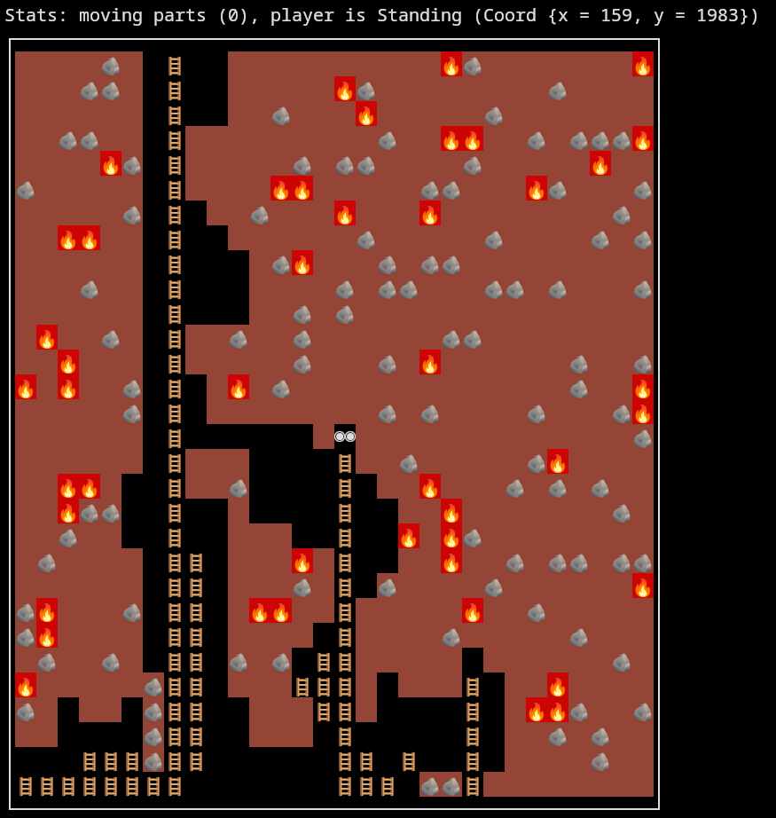

A proof-of-concept that an interactive game can be written in Haskell.

I recreated in Haskell a small part of my favorite mobile game, RoboMiner. Check it out!

I used this project to learn how to use 
- monad transformers, to encode my program in a type-safe way that only later is evaluated in IO
- the ST (Threaded state) monad, to efficiently create a pure value of a large matrix whose construction requires mutable operations (without having to copy the entire matrix on each wanted mutation)
- existential types, to make a type-safe indexing operation into the grid (following the idea in the justified-containers package). This allows bug-free board indexing that is never out of bounds.

Thus I convinced myself that 
- it is possible to write an interactive program in a purely functional language 
- it is possible to manipulate a 2000x50 matrix efficiently in a type-safe way, without needing to copy the entire structure, in a purely functional language (through a monadic interface).
- it is possible in Haskell to read input and render dynamically on screen, both in a terminal and in an actual window (using SDL).

The game has a TTY frontend (simply `cabal run`) and an SDL2 frontend (`cabal run exes -- SDL`).
Tested on linux only. Controls are arrows/hjkl.

Here's a "screenshot" from the gameplay with the tty frontend (browser renderer slightly distorts
unicode widths, it renders fine on supported terminals --- see png screenshot below):

```
Stats: moving parts (0), player is Standing (Coord {x = 159, y = 1983})
┌────────────────────────────────────────────────────────────┐
│        🪨    🪜                        🔥🪨              🔥│
│      🪨🪨    🪜              🔥🪨                🪨        │
│              🪜        🪨      🔥          🪨              │
│    🪨🪨      🪜                  🪨    🔥🔥    🪨  🪨🪨🪨🔥│
│        🔥🪨  🪜          🪨  🪨🪨        🪨          🔥    │
│🪨            🪜        🔥🔥          🪨🪨      🔥🪨      🪨│
│          🪨  🪜      🪨      🔥      🔥                🪨  │
│    🔥🔥      🪜                🪨          🪨        🪨  🪨│
│              🪜        🪨🔥      🪨  🪨🪨                  │
│      🪨      🪜              🪨  🪨🪨      🪨🪨  🪨      🪨│
│              🪜          🪨  🪨                            │
│  🔥    🪨    🪜    🪨    🪨            🪨🪨                │
│    🔥        🪜          🪨      🪨  🔥            🪨    🪨│
│🔥  🔥    🪨  🪜    🔥  🪨                          🪨    🔥│
│          🪨  🪜                  🪨  🪨        🪨      🪨🔥│
│              🪜              ◉◉                          🪨│
│              🪜              🪜    🪨          🪨🔥        │
│    🔥🔥      🪜    🪨        🪜      🔥      🪨  🪨  🪨    │
│    🔥🪨🪨    🪜              🪜        🔥              🪨  │
│    🪨        🪜              🪜    🔥  🔥🪨                │
│  🪨          🪜🪜        🔥  🪜        🔥    🪨  🪨🪨  🪨🪨│
│              🪜🪜        🪨  🪜  🪨        🪨            🔥│
│🪨🔥      🪨  🪜🪜    🔥🔥    🪜          🔥    🪨          │
│🪨🔥          🪜🪜            🪜        🪨          🪨      │
│  🪨    🪨    🪜🪜  🪨  🪨  🪜🪜                        🪨  │
│🔥          🪨🪜🪜        🪜🪜🪜          🪜      🔥        │
│🪨          🪨🪜🪜          🪜🪜          🪜    🔥🔥🪨    🪨│
│            🪨🪜🪜            🪜          🪜      🪨  🪨    │
│      🪜🪜🪜🪨🪜🪜            🪜🪜  🪜    🪜          🪨    │
│🪜🪜🪜🪜🪜🪜🪜🪜              🪜🪜🪜  🪨🪨🪜                │
└────────────────────────────────────────────────────────────┘
```


